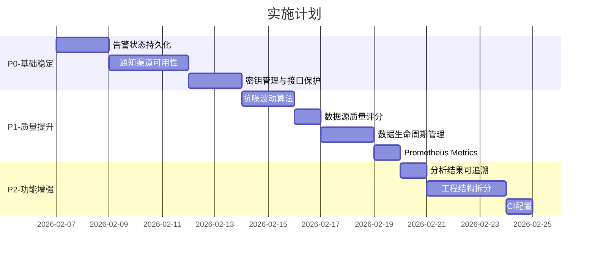

# 黄金价格监控系统 - 稳定性与功能增强完整方案

## 优先级说明

- **P0**: 系统可长期稳定运行的基础，必须优先实现
- **P1**: 提升系统质量和可维护性，中期完成
- **P2**: 功能增强和用户体验优化，后期迭代

---

## P0: 基础稳定性（第一阶段）

### 1. 告警状态持久化

**问题**: `alert.py` 中 `_last_alerts` 和 `_price_history` 完全在内存中（第204-208行），服务重启后丢失

**方案**:

新增 `AlertState` 数据库模型（修改 `models.py`）：

```python
class AlertState(Base):
    """告警状态持久化表"""
    __tablename__ = "alert_states"
    
    id = Column(Integer, primary_key=True)
    alert_type = Column(String(50), unique=True, nullable=False)
    last_triggered_at = Column(DateTime, nullable=True)
    cooldown_until = Column(DateTime, nullable=True)
    base_price = Column(Float, nullable=True)  # 波动计算基准价
    window_prices = Column(Text, nullable=True)  # JSON序列化的价格序列
    updated_at = Column(DateTime, default=datetime.utcnow)
```

修改 `AlertMonitor` 类：

- 启动时从数据库恢复状态
- `_record_alert()` 同时更新数据库
- `_update_price_history()` 定期持久化（如每分钟）

**涉及文件**: `models.py`, `alert.py`

---

### 2. 通知渠道真正可用

**问题**: 通知渠道实现了但缺少失败重试、发送记录、Web配置

**方案**:

**(a) 通知发送记录表**（修改 `models.py`）：

```python
class NotificationLog(Base):
    """通知发送记录"""
    __tablename__ = "notification_logs"
    
    id = Column(Integer, primary_key=True)
    alert_id = Column(Integer, ForeignKey("alert_records.id"))
    channel = Column(String(50), nullable=False)  # email/webhook/telegram
    status = Column(String(20), nullable=False)   # success/failed/pending
    error_message = Column(Text, nullable=True)
    retry_count = Column(Integer, default=0)
    sent_at = Column(DateTime, default=datetime.utcnow)
```

**(b) 失败重试机制**（修改 `alert.py`）：

```python
class NotificationManager:
    """通知管理器 - 统一管理所有渠道"""
    
    async def send_with_retry(self, alert: Alert, max_retries: int = 3):
        for channel in self._enabled_channels:
            for attempt in range(max_retries):
                success = await channel.send(alert)
                self._log_notification(alert, channel, success, attempt)
                if success:
                    break
                await asyncio.sleep(2 ** attempt)  # 指数退避
```

**(c) 通知渠道配置表**（Web可配置）：

```python
class NotificationConfig(Base):
    """通知渠道配置"""
    __tablename__ = "notification_configs"
    
    id = Column(Integer, primary_key=True)
    channel_type = Column(String(50), nullable=False)
    enabled = Column(Boolean, default=False)
    config = Column(Text)  # JSON配置（不含密钥）
    created_at = Column(DateTime, default=datetime.utcnow)
```

**(d) 新增API接口**:

- `GET /api/notifications/config` - 获取通知配置
- `PUT /api/notifications/config/{channel}` - 更新配置
- `GET /api/notifications/logs` - 发送记录查询
- `POST /api/notifications/test/{channel}` - 测试发送

**涉及文件**: `models.py`, `alert.py`, `web.py`（或拆分为 `routes/notifications.py`）

---

### 3. 配置/密钥管理与接口保护

**问题**: 

- `llm_config.json` 明文存储API Key（第163-165行）
- 配置类接口无鉴权

**方案**:

**(a) 密钥加密存储**（新增 `security.py`）：

```python
from cryptography.fernet import Fernet
import os

class SecretManager:
    """密钥管理器"""
    
    def __init__(self):
        # 从环境变量获取主密钥，或自动生成
        self._key = os.getenv("GOLD_SECRET_KEY") or self._generate_key()
        self._cipher = Fernet(self._key)
    
    def encrypt(self, plaintext: str) -> str:
        return self._cipher.encrypt(plaintext.encode()).decode()
    
    def decrypt(self, ciphertext: str) -> str:
        return self._cipher.decrypt(ciphertext.encode()).decode()
```

修改 `llm_config.py`：

- 存储时加密：`api_key` -> `encrypted_api_key`
- 读取时解密
- 优先使用环境变量中的密钥

**(b) 配置接口鉴权**（新增简单API Key或BasicAuth）：

```python
# config.py 新增
admin_api_key: str = Field(default="", description="管理接口API Key")

# 中间件
async def verify_admin_key(request: Request):
    if request.url.path.startswith("/api/llm/") or \
       request.url.path.startswith("/api/collector/config"):
        key = request.headers.get("X-Admin-Key")
        if not key or key != settings.admin_api_key:
            raise HTTPException(401, "Unauthorized")
```

**(c) 接口限流**（使用 slowapi）：

```python
from slowapi import Limiter
from slowapi.util import get_remote_address

limiter = Limiter(key_func=get_remote_address)

@app.get("/api/llm/config")
@limiter.limit("10/minute")
async def get_llm_config(request: Request):
    ...
```

**涉及文件**: 新增 `security.py`, 修改 `llm_config.py`, `web.py`, `config.py`

**新增依赖**: `cryptography`, `slowapi`

---

## P1: 质量提升（第二阶段）

### 4. 更"抗噪"的波动算法

**问题**: 当前只用窗口首尾价格计算涨跌幅，容易被尖刺噪声误触发

**方案**（修改 `alert.py`）：

```python
class VolatilityDetector:
    """波动检测器 - 多维度分析"""
    
    def analyze(self, prices: list[tuple[datetime, float]]) -> VolatilityResult:
        return VolatilityResult(
            change_percent=self._calc_change_percent(prices),      # 首尾涨跌幅
            amplitude_percent=self._calc_amplitude(prices),        # 振幅 (high-low)/base
            rolling_std=self._calc_rolling_std(prices),            # 滚动标准差
            consecutive_trend=self._calc_trend(prices),            # 连续N次同向
            event_type=self._detect_event(prices)                  # breakout/pullback
        )
    
    def should_alert(self, result: VolatilityResult) -> bool:
        # 多条件联合判断，降低误报
        return (
            abs(result.change_percent) >= self._threshold and
            result.consecutive_trend >= 3 and  # 至少连续3次采样确认趋势
            result.amplitude_percent < 5.0     # 排除剧烈震荡
        )
```

**新增告警类型**:

- `BREAKOUT_UP`: 向上突破
- `BREAKOUT_DOWN`: 向下突破
- `PULLBACK`: 回落

**涉及文件**: `alert.py`

---

### 5. 多数据源融合与质量评分

**问题**: 有并行采集但未展示数据源置信度

**方案**（修改 `collector.py`）：

```python
@dataclass
class SourceQuality:
    """数据源质量评分"""
    name: str
    reliability_score: float  # 基于成功率和延迟计算 (0-100)
    freshness_score: float    # 数据新鲜度
    weight: float             # 融合权重
    
def _calc_reliability_weight(self, stats: SourceStats) -> float:
    """计算可靠性权重"""
    success_factor = stats.success_rate / 100
    latency_factor = max(0, 1 - stats.avg_latency_ms / 5000)
    return success_factor * 0.7 + latency_factor * 0.3
```

**前端展示**: 在价格显示区域增加"数据源置信度"指示器

**涉及文件**: `collector.py`, `web.py`（前端部分）

---

### 6. 数据生命周期管理

**问题**: 数据无限增长，无归档/清理机制

**方案**（新增 `data_lifecycle.py`）：

```python
class DataLifecycleManager:
    """数据生命周期管理"""
    
    async def cleanup(self):
        """定期清理任务"""
        # 1. 分钟级数据保留30天
        await self._archive_minute_data(days=30)
        
        # 2. 30天前聚合为小时级
        await self._aggregate_to_hourly(days=30)
        
        # 3. 90天前聚合为日级
        await self._aggregate_to_daily(days=90)
    
    async def export_csv(self, start: datetime, end: datetime) -> str:
        """导出CSV"""
        ...
    
    async def export_json(self, start: datetime, end: datetime) -> str:
        """导出JSON"""
        ...
    
    async def backup_database(self):
        """数据库备份"""
        ...
```

**新增API**:

- `GET /api/data/export?format=csv&start=...&end=...`
- `POST /api/data/cleanup` (需要admin权限)
- `POST /api/data/backup`

**涉及文件**: 新增 `data_lifecycle.py`, 修改 `web.py`

---

### 7. 可观测性（Prometheus Metrics）

**方案**（新增 `metrics.py`）：

```python
from prometheus_client import Counter, Gauge, Histogram, generate_latest

# 指标定义
FETCH_TOTAL = Counter("gold_fetch_total", "Total fetch attempts", ["source", "status"])
FETCH_LATENCY = Histogram("gold_fetch_latency_seconds", "Fetch latency", ["source"])
CURRENT_PRICE = Gauge("gold_current_price_usd", "Current gold price in USD")
ALERT_TOTAL = Counter("gold_alert_total", "Total alerts triggered", ["type"])
NOTIFICATION_TOTAL = Counter("gold_notification_total", "Notifications sent", ["channel", "status"])

@app.get("/metrics")
async def metrics():
    return Response(generate_latest(), media_type="text/plain")
```

**采集器集成**: 在 `collector.py` 的 `fetch_once()` 中更新指标

**Grafana Dashboard**: 提供预置的 dashboard JSON

**涉及文件**: 新增 `metrics.py`, 修改 `collector.py`, `alert.py`, `web.py`

**新增依赖**: `prometheus-client`

---

## P2: 功能增强（第三阶段）

### 8. 分析结果可追溯

**方案**（修改 `models.py`）：

```python
class AnalysisRecord(Base):
    """AI分析记录"""
    __tablename__ = "analysis_records"
    
    id = Column(Integer, primary_key=True)
    analysis_type = Column(String(50))  # volatility/smart
    model_provider = Column(String(50))
    model_name = Column(String(100))
    price_range_start = Column(DateTime)
    price_range_end = Column(DateTime)
    input_summary = Column(Text)  # 输入数据摘要
    result = Column(Text)  # 分析结果JSON
    created_at = Column(DateTime, default=datetime.utcnow)
```

**新增API**: `GET /api/analysis/history`

**涉及文件**: `models.py`, `analyzer.py`, `web.py`

---

### 9. 工程结构优化

**问题**: `web.py` 3389行，难以维护

**方案**: 按职责拆分

```
src/gold_monitor/
├── web.py              # 主入口，仅保留 app 创建和生命周期
├── routes/             # 路由模块
│   ├── __init__.py
│   ├── price.py        # /api/price/*
│   ├── alerts.py       # /api/alerts/*
│   ├── analysis.py     # /api/analysis/*, /api/smart-analysis/*
│   ├── collector.py    # /api/collector/*
│   ├── llm.py          # /api/llm/*
│   ├── notifications.py # /api/notifications/*
│   └── data.py         # /api/data/* (导出/备份)
├── services/           # 业务逻辑层
│   ├── __init__.py
│   ├── price_service.py
│   ├── alert_service.py
│   └── analysis_service.py
└── middleware/         # 中间件
    ├── __init__.py
    ├── auth.py
    └── rate_limit.py
```

**CI配置**（新增 `.github/workflows/ci.yml`）：

```yaml
name: CI
on: [push, pull_request]
jobs:
  lint:
    runs-on: ubuntu-latest
    steps:
      - uses: actions/checkout@v4
      - run: pip install ruff mypy
      - run: ruff check src/
      - run: mypy src/
  
  test:
    runs-on: ubuntu-latest
    steps:
      - uses: actions/checkout@v4
      - run: pip install -e ".[dev]"
      - run: pytest tests/ -v --cov=src/
  
  docker:
    runs-on: ubuntu-latest
    steps:
      - uses: actions/checkout@v4
      - run: docker build -t gold-monitor .
```

**涉及文件**: 重构 `web.py`, 新增 `routes/`, `services/`, `middleware/`, `.github/workflows/ci.yml`

---

## 实施建议

### 推荐实施顺序




### 最小可行路径（如果只选3个）

1. **告警状态持久化** - 解决重启丢状态问题
2. **通知渠道可用性** - 让告警真正能发出去
3. **密钥管理与接口保护** - 基本安全保障

完成这3项后，系统就能"可长期稳定用"了。

---

## 新增依赖汇总

```toml
# pyproject.toml 新增
dependencies = [
    # P0
    "cryptography>=41.0.0",      # 密钥加密
    "slowapi>=0.1.9",            # API限流
    # P1
    "prometheus-client>=0.19.0", # 指标暴露
    # 开发依赖
    "ruff>=0.1.0",               # 代码检查
    "mypy>=1.8.0",               # 类型检查
    "pytest-cov>=4.1.0",         # 测试覆盖
]
```

